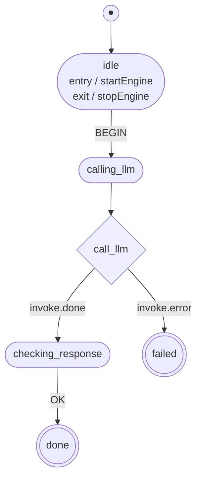

# gstate

A type-safe Statechart library for Go, inspired by [XState](https://xstate.js.org/).

`gstate` allows you to model complex application logic using finite state machines and statecharts. Unlike traditional logic scattered across `if/else` blocks and boolean flags, statecharts provide a formal, visual, and structured way to define how your system behaves.

## What is a Statechart?

A Statechart is an extension of a Finite State Machine (FSM). While a basic FSM has a set of states and transitions, a Statechart adds:
- **Hierarchy**: States can contain other states (Nested States).
- **Orthogonality**: Multiple states can be active at once (Parallel States).
- **Broadcast**: Events can trigger transitions in multiple regions.
- **History**: The ability to "remember" where you were before leaving a state.

## Installation

```bash
go get github.com/floodfx/gstate
```

---

## 1. The Basics: States, Events, and Transitions

Every statechart starts with three core concepts:
- **State**: A specific condition or "mode" of your system (e.g., `Idle`, `Loading`, `Success`).
- **Event**: Something that happens (e.g., `START`, `MOUSE_CLICK`, `TIMEOUT`).
- **Transition**: A rule that says: "When in state A, if event E happens, move to state B."

### Example: A Simple Toggle with Typed Constants
```go
type MyState string
type MyEvent string

const (
    StateOff MyState = "off"
    StateOn  MyState = "on"
)

const (
    EventToggle MyEvent = "TOGGLE"
)

// Define a simple data type that implements the Cloner interface
type MyData struct{}

func (d MyData) Clone() MyData {
    return d
}

machine := gstate.New[MyState, MyEvent, MyData]("toggle").
    Initial(StateOff).
    State(StateOff, func(s *gstate.StateBuilder[MyState, MyEvent, MyData]) {
        s.On(EventToggle).GoTo(StateOn)
    }).
    State(StateOn, func(s *gstate.StateBuilder[MyState, MyEvent, MyData]) {
        s.On(EventToggle).GoTo(StateOff)
    }).
    Build()
```

> **Try it:** [basics example](./examples/basics) — states, events, transitions, data, and entry/exit actions.

---

## 2. Type Safety & Generics

One of the core strengths of `gstate` is its use of Go 1.18+ generics to provide strict type safety.

The library uses three generic parameters: `[S ~string, E ~string, D Cloner[D]]`.

- **`S` (State ID)**: By using a custom string type (e.g., `type MyState string`), you ensure that `Initial()`, `State()`, and `GoTo()` only accept valid state identifiers.
- **`E` (Event ID)**: Similarly, `On(event)` only accepts events of your specific type.
- **`D` (Data)**: The data your machine holds is strictly typed, and MUST satisfy the `gstate.Cloner[D]` constraint. Actions and guards receive this exact type, eliminating the need for dynamic casting and guaranteeing thread-safe reads/writes during actor execution.

**Benefits:**
- **No Typos**: Compilers will catch `actor.Send("TYPO")` if your event type is strictly defined.
- **IDE Support**: Autocomplete works for states, events, and data fields.
- **Safety**: Guards and Actions are verified at compile time to work with your specific data structure.

---

## 3. Managing State Data (`Assign`)

Statecharts aren't just about labels; they often need to hold data. In `gstate`, this is called **Data**.

Transitions can perform **Actions** to update this data. In Go, these are pure functions: `func(D) D`.

```go
type CounterData struct {
    Count int
}

s.On("INCREMENT").
    Assign(func(d CounterData) CounterData {
        d.Count++
        return d
    })
```

#### Thread Safety via `Cloner` Constraint

To guarantee thread-safe read/write isolation when snapshotting or observing a running Actor, the Data type `D` must satisfy the `Cloner[D]` constraint.

If your Data consists solely of value types (like `struct{ Count int }`), implementing `Clone()` is as simple as returning `c`:

```go
func (d MyData) Clone() MyData {
    return d
}
```

If your data type contains reference types (pointers, slices, maps), you must perform a deep copy inside `Clone()` to ensure true isolation:

```go
type MyData struct {
    Data []int
}

func (d MyData) Clone() MyData {
    newData := make([]int, len(c.Data))
    copy(newData, c.Data)
    return MyData{Data: newData}
}
```

---

## 4. Entry and Exit Actions

States can define actions that run whenever they are entered or exited. This is useful for setup/teardown, logging, or any side effect tied to a state's lifecycle.

```go
s.State(StateActive, func(s *gstate.StateBuilder[MyState, MyEvent, MyData]) {
    s.Entry(func(d MyData) MyData {
        fmt.Println("[active] Entering state...")
        return d
    })

    s.Exit(func(d MyData) MyData {
        fmt.Println("[active] Leaving state...")
        return d
    })

    s.On(EventStop).GoTo(StateIdle)
})
```

- **`Entry`** runs when the state is entered, before any child states are resolved.
- **`Exit`** runs when the state is left, as part of the transition.

Optional `EntryLabel(name)` / `ExitLabel(name)` attach a human-readable name to the actions. The name doesn't change runtime behavior; it shows up inside the state's node in Mermaid output (see [§Mermaid Diagrams](#mermaid-diagrams)) so a reader of the generated diagram can tell *what* runs on entry/exit without reading the builder code.

```go
s.Entry(loadUserPrefs)
s.EntryLabel("loadUserPrefs")
```

---

## 5. Hierarchical (Nested) States

In a complex system, some states are "sub-modes" of others. For example, a `User` state might have `Guest` and `LoggedIn` sub-states.

**Why use this?**
- **Bubbling**: If a child state doesn't handle an event, it "bubbles up" to the parent.
- **Organization**: Group related logic together.
- **Common Actions**: Define an `Entry` action on a parent that runs regardless of which child is entered.

```go
s.State("parent", func(s *gstate.StateBuilder[MyState, MyEvent, MyData]) {
    s.Initial("childA")
    
    // If ANY child receives "RESET", we go to "parent.childA"
    s.On("RESET").GoTo("childA")

    s.State("childA", func(s *gstate.StateBuilder[MyState, MyEvent, MyData]) { ... })
    s.State("childB", func(s *gstate.StateBuilder[MyState, MyEvent, MyData]) { ... })
})
```

> **Try it:** [hierarchy example](./examples/hierarchy) — nested states with event bubbling and entry/exit ordering.

---

## 6. History States

History allows a compound state to remember which of its children was active before it was exited. When you re-enter the state, it resumes where it left off instead of going to the `Initial` child.

Two history types are available:
- **`gstate.Shallow`**: Remembers the direct child that was active.
- **`gstate.Deep`**: Remembers all active descendants in the hierarchy.

```go
machine := gstate.New[MyState, MyEvent, MyData]("history_demo").
    Initial("app").
    State("app", func(s *gstate.StateBuilder[MyState, MyEvent, MyData]) {
        s.History(gstate.Shallow)
        s.Initial("screen1")

        s.State("screen1", func(s *gstate.StateBuilder[MyState, MyEvent, MyData]) {
            s.On("SWITCH").GoTo("screen2")
        })
        s.State("screen2", func(s *gstate.StateBuilder[MyState, MyEvent, MyData]) {
            s.On("SWITCH").GoTo("screen1")
        })

        s.On("GO_IDLE").GoTo("idle")
    }).
    State("idle", func(s *gstate.StateBuilder[MyState, MyEvent, MyData]) {
        s.On("WAKE").GoTo("app")
    }).
    Build()
```

In this example, if the user navigates to `screen2` and then goes idle, `WAKE` will return them to `screen2` (not the initial `screen1`).

> **Try it:** [history example](./examples/history) — shallow history remembers which child was active.

---

## 7. Parallel States

Sometimes a system is in multiple modes at once. A text editor might be `Focused` while also having `Bold` enabled.

Parallel states allow you to define regions that operate independently. Use `actor.States()` to see all active states.

```go
s.State("active", func(s *gstate.StateBuilder[MyState, MyEvent, MyData]) {
    s.Type(gstate.Parallel)

    s.State("keyboard", func(s *gstate.StateBuilder[MyState, MyEvent, MyData]) {
        s.Initial("caps_off")
        s.State("caps_off", func(s *gstate.StateBuilder[MyState, MyEvent, MyData]) {
            s.On("CAPS_LOCK").GoTo("caps_on")
        })
        s.State("caps_on", func(s *gstate.StateBuilder[MyState, MyEvent, MyData]) {
            s.On("CAPS_LOCK").GoTo("caps_off")
        })
    })

    s.State("mouse", func(s *gstate.StateBuilder[MyState, MyEvent, MyData]) {
        s.Initial("not_clicked")
        s.State("not_clicked", func(s *gstate.StateBuilder[MyState, MyEvent, MyData]) {
            s.On("CLICK").GoTo("clicked")
        })
        s.State("clicked", func(s *gstate.StateBuilder[MyState, MyEvent, MyData]) {
            s.On("RELEASE").GoTo("not_clicked")
        })
    })
})

// ...
fmt.Printf("Active States: %v\n", actor.States())
// Output: Active States: [active keyboard caps_off mouse not_clicked]
```

> **Try it:** [parallel example](./examples/parallel) — independent keyboard and mouse regions.

---

## 8. Side Effects: Invoke and After

### Invoked Services (`Invoke`)
Used for asynchronous work (like an API call). The service starts when you enter the state and is **automatically cancelled** (via `context.Context`) if you leave the state before it finishes.

To prevent data races between concurrent transitions and background goroutines, **mutations from inside an Invoke must go through the provided `mutate` callback**:

```go
s.Invoke(func(ctx context.Context, snap MyData, mutate func(func(MyData) MyData)) error {
    // Use `snap` to read the state data at entry.
    // Use the thread-safe `mutate` callback to safely update data.
    mutate(func(d MyData) MyData {
        d.Value = "updated"
        return d
    })
    return doExpensiveWork(ctx)
}, "onSuccessState", "onErrorState")
```

The `mutate` callback accepts a function that receives the current data and returns the updated data. This update runs under the actor's internal write lock, ensuring complete race-free synchronization. If the state is exited or the actor stops before the callback runs, the mutation is safely ignored (no-op'd) to prevent stale/obsolete writes.

Optional `InvokeLabel(name)` names the invocation for Mermaid output. When both success and error targets are set, the labeled invoke renders as a diamond pseudo-state with `invoke.done` and `invoke.error` outgoing arrows — see [§Mermaid Diagrams](#mermaid-diagrams).

```go
s.Invoke(callLLM, "checking_response", "failed")
s.InvokeLabel("call_llm")
```

### Delayed Transitions (`After`)
Transitions that happen automatically after a duration.

```go
s.State("loading", func(s *gstate.StateBuilder[MyState, MyEvent, MyData]) {
    // If we are stuck here for 5 seconds, move to "error"
    s.After(5 * time.Second).GoTo("error")
})
```

> **Try it:** [invoke example](./examples/invoke) — async services with cancellation. [delayed example](./examples/delayed) — automatic timeouts.

---

## 9. Transient Logic (`Always`)

`Always` transitions fire immediately if their **Guard** (a condition function) is met. They don't wait for an external event. This is useful for "decider" states.

```go
s.State("check_balance", func(s *gstate.StateBuilder[MyState, MyEvent, MyData]) {
    s.Always().
        Guard(func(d MyData) bool { return d.Balance > 100 }).
        GoTo("premium_user")
    
    s.Always().GoTo("regular_user") // Fallback
})
```

---

## 10. Final States

A `Final` state indicates the completion of its parent's process. Once entered, no further transitions are processed from that state.

```go
s.State("done", func(s *gstate.StateBuilder[MyState, MyEvent, MyData]) {
    s.Type(gstate.Final)
})
```

> **Try it:** [agent example](./examples/agent) — guards, always transitions, retries, and final states in a real workflow.

---

## 11. Build-Time Static Validation

To prevent silent runtime errors (such as transitions to non-existent states due to typos), `gstate` performs static-analysis validation at build time when you call `Build()`. 

If a machine definition violates any structural rules, `Build()` will fail-fast by **panicking** with a clear, descriptive message prefixed with `gstate:`.

### Validation Rules
1. **Initial States**:
   - The top-level machine `Initial(state)` reference must point to a valid, declared state.
   - For any compound state, its `Initial(state)` reference must point to a valid child state declared within that compound parent.
2. **Transition Targets**:
   - Any target specified in a `.GoTo(state)` transition (for standard event transitions, `Always` transitions, and `After` delayed transitions) must point to a valid, declared state (targetless / internal transitions are allowed).
3. **Invoke Targets**:
   - The `onDone` and `onError` targets specified in `s.Invoke(handler, onDone, onError)` must point to valid, declared states.

### Example Validation Failures

```go
// Panics: "gstate: initial state 'invalid_state' not found in machine"
machine := gstate.New[MyState, MyEvent, any]("invalid_initial").
    Initial("invalid_state").
    Build()

// Panics: "gstate: transition target 'typo_state' in state 'idle' not found in machine"
machine := gstate.New[MyState, MyEvent, any]("invalid_target").
    Initial("idle").
    State("idle", func(s *gstate.StateBuilder[MyState, MyEvent, any]) {
        s.On("START").GoTo("typo_state")
    }).
    Build()
```

---

## 12. Observing Lifecycle Events

When you want to record transitions, guard outcomes, state entries/exits, transition actions, and invoked services — for telemetry, tracing, audit logs, or just to debug what your machine is doing — you do **not** need to wrap every `Entry`, `Exit`, `Guard`, and `Invoke` by hand. Pass one or more observers to `Start`:

```go
rec := &gstate.RecordingObserver[MyState, MyEvent, MyData]{}
actor := gstate.Start(machine, MyData{}, machine.WithObservers(rec))
```

> The `machine.WithObservers(...)` form lets Go infer the `[MyState, MyEvent, MyData]` type parameters from `machine`, so you don't have to repeat them on every option. `WithObservers` is variadic — pass any number of observers and they all receive callbacks for the kinds they implement.

`Observer[S, E, D]` is a sealed marker interface; you opt into specific callback kinds by implementing any of the nine narrow observer interfaces. The engine builds and dispatches each payload only when at least one installed observer subscribes to that kind, so unused hooks cost nothing.

| Narrow interface | Method | Fires when |
|---|---|---|
| `EventReceivedObserver` | `OnEventReceived` | An event lands in the mailbox and is about to be processed |
| `GuardObserver` | `OnGuardEvaluated` | A non-nil `Guard` was evaluated (carries the boolean result) |
| `EventDroppedObserver` | `OnEventDropped` | An event was processed but no transition fired (`Reason: "no_transition"`) |
| `StateExitedObserver` | `OnStateExited` | A state's `Exit` actions completed and the state was removed from `active` |
| `ActionObserver` | `OnActionExecuted` | A transition's `Action` (Assign) completed |
| `StateEnteredObserver` | `OnStateEntered` | A state's `Entry` actions completed and the state is now `active` |
| `TransitionObserver` | `OnTransition` | A transition fully resolved (after all exits + entries) |
| `InvokeStartedObserver` | `OnInvokeStarted` | An invoked service goroutine was launched |
| `InvokeCompletedObserver` | `OnInvokeCompleted` | An invoked service returned (success, error, or cancellation) |

### Threading and locking contract

- All callbacks except `OnInvokeCompleted` run **synchronously on the actor's event-processing goroutine** while it holds the actor's internal write lock. This includes `OnInvokeStarted`, which fires when an invoked service is launched during state entry. Implementations must be non-blocking.
- Observers **must not** call methods on the same `Actor` that would re-enter the actor lock (e.g. `Snapshot()`, `State()`).
- Observers **must not** call `Send` / `SendCtx` synchronously: the channel send can block on a full mailbox, and the loop goroutine that would drain it cannot acquire the actor lock the observer is holding — a hard deadlock. If you need to dispatch an event from an observer, do it from a fresh goroutine:
  ```go
  func (o *myObs) OnTransition(_ context.Context, e *gstate.TransitionEvent[...]) {
      go func() { actor.Send(EventX) }()
  }
  ```
- Payload structs expose data via a lazy `Data()` method (rather than a field). The first call to `e.Data()` clones the actor's data via `Cloner.Clone()` and caches the result with `sync.Once`; subsequent calls (including from other observers receiving the same payload pointer) return the cached pointer without re-cloning. Observers that don't need the data pay zero clones. Reading is safe; mutating the pointee has no effect on the actor.
- When multiple observers subscribe to the same callback kind, the engine builds the payload **once** and passes the same pointer to each. The shared `sync.Once` on the payload guarantees at most one clone per callback firing across the whole fan-out.
- `OnInvokeCompleted` fires from the invoke goroutine and does not hold the actor lock.

### Implementing only the methods you care about (`BaseObserver`)

Embed `BaseObserver[S, E, D]` to satisfy the marker interface, then implement only the narrow observer interfaces you need. Any callback you don't implement simply isn't dispatched to you — there are no required stubs.

```go
type loggingObs struct {
    gstate.BaseObserver[MyState, MyEvent, MyData]
}

// implements TransitionObserver — every other callback kind is skipped for this observer
func (l *loggingObs) OnTransition(ctx context.Context, e *gstate.TransitionEvent[MyState, MyEvent, MyData]) {
    log.Printf("[%s] %s --%s--> %s", e.ActorID, e.From, e.Event, e.To)
}
```

A single observer type may implement any subset (or all nine) of the narrow interfaces — the engine independently type-asserts your value against each one at install time and only dispatches the kinds you implement.

### Wake on any lifecycle event with `SignalObserver`

```go
ready := make(chan struct{}, 1)
obs := gstate.SignalObserver[MyState, MyEvent, MyData](func() {
    select { case ready <- struct{}{}: default: }
})
actor := gstate.Start(machine, ctx, machine.WithObservers(obs))
actor.Send(EventGo)
<-ready // deterministically woken by the first lifecycle callback
```

Every callback on `SignalObserver` calls the supplied function. The callback's context and typed payload are discarded — `SignalObserver` is intentionally minimal. If you need them, use `ObserverFuncs` (below). The signal function must be non-blocking — observer callbacks run synchronously under the actor's write lock.

### Avoid boilerplate with `ObserverFuncs`

```go
obs := gstate.ObserverFuncs[MyState, MyEvent, MyData]{
    AnyFunc: func(ctx context.Context) {
        // fires for every callback
    },
    TransitionFunc: func(ctx context.Context, e *gstate.TransitionEvent[MyState, MyEvent, MyData]) {
        log.Printf("[%s] %s --%s--> %s", e.ActorID, e.From, e.Event, e.To)
    },
}
actor := gstate.Start(machine, ctx, machine.WithObservers(obs))
```

`ObserverFuncs` is a struct of optional function fields plus a generic `AnyFunc`. Each callback dispatches to `AnyFunc` first (if set), then to the kind-specific field (if set). Nil fields are no-ops. Useful when you want a partial observer without defining a named type, or when one hook should fire for every event in addition to specific typed handlers.

### Inspecting behavior with `RecordingObserver`

`RecordingObserver[S, E, D]` captures every callback into a thread-safe log. It is useful in tests and for ad-hoc debugging:

```go
rec := &gstate.RecordingObserver[MyState, MyEvent, MyData]{}
actor := gstate.Start(machine, MyData{}, machine.WithObservers(rec))
actor.Send(EventGo)

for _, t := range rec.Transitions() {
    fmt.Printf("%s -> %s on %s\n", t.From, t.To, t.Event)
}

// or by kind:
for _, ev := range rec.Events(gstate.KindGuardEvaluated, gstate.KindTransition) {
    fmt.Printf("%s @ %s: %+v\n", ev.Kind, ev.Timestamp.Format(time.RFC3339Nano), ev.Payload)
}
```

> **Try it:** [observer example](./examples/observer) — attach a `RecordingObserver` to a small machine and print the lifecycle log.

### Printing and serializing payloads

Every payload type implements `fmt.Stringer` with a short, stable format, so `fmt.Println(e)` produces readable output. `RecordedEvent.String()` delegates to the embedded payload, so a recorder log can be dumped with a single `fmt.Println(ev)`:

```go
for _, ev := range rec.Events() {
    fmt.Println(ev)
    // transition: transition[V1StGXR8_Z5j]: idle --GO--> active
    // guard: guard[V1StGXR8_Z5j]: idle --GO[active]: result=true
    // ...
}
```

Payload structs also carry `json` tags and a custom `MarshalJSON` that materializes `Data()` into a top-level `data` field at marshal time, so they can be marshaled directly for shipping to a telemetry pipeline. `InvokeEvent.Error` is rendered as its `Error()` string (or omitted when nil) via the same mechanism:

```go
b, _ := json.Marshal(rec.Transitions()[0])
// {"machine_id":"...","actor_id":"V1StGXR8_Z5j","from":"idle","to":"active","event":"GO","data":{...},"timestamp":"..."}
```

---

## The Actor: Running a Machine

A `Machine` is a static blueprint. To actually run it, you create an **Actor**. The Actor holds the live state, processes events, and manages async services.

### Creating an Actor

```go
// Start with default options
actor := gstate.Start(machine, MyData{Count: 0})

// Or with one or more functional options — call them as methods on the
// machine to let Go infer the [S, E, D] type parameters.
actor := gstate.Start(machine, MyData{Count: 0},
    machine.WithMailboxSize(500),
    machine.WithObservers(logger, recorder),
    machine.WithActorID("worker-42"),
)
```

Available options:

- `WithMailboxSize(n)` — buffered capacity for the event channel. Default `100`.
- `WithObservers(obs...)` — install one or more [observers](#12-observing-lifecycle-events). Variadic; pass any number of observers (each implementing whichever narrow callback interfaces it cares about). When omitted, no observer is installed and the engine skips payload construction entirely.
- `WithActorID(id)` — override the auto-generated [`ActorID`](#actor-identity).

### Actor Identity

Every actor is born with a stable `ActorID`. When you don't supply one via `WithActorID`, `Start` generates a short URL-safe nanoid:

```go
actor := gstate.Start(machine, MyData{})
fmt.Println(actor.ID()) // e.g. "V1StGXR8_Z5j"
```

`ActorID` is the correlation key surfaced in every `Observer` payload. It is **preserved across `Snapshot` / `Hydrate`** so the same logical actor keeps its identity across restarts.

### Sending Events

```go
actor.Send(EventIncrement)            // fire-and-forget
err := actor.SendCtx(ctx, EventStart) // ctx-honoring, returns error
```

Events are queued in a channel-based mailbox and processed sequentially, ensuring state transitions are never concurrent.

`Send` is a thin wrapper around `SendCtx(context.Background(), event)` that discards the returned error. Use it when you don't have a request-scoped context and don't need to react to delivery failure. After `Stop` it is a no-op (no panic, no delivery).

### Request-Scoped Context

To attach a `context.Context` to an event — for tracing IDs, request deadlines, or any value you want delivered to observer callbacks — use `SendCtx`:

```go
ctx := tracing.ContextWithSpan(req.Context(), span)
if err := actor.SendCtx(ctx, EventDoTheThing); err != nil {
    // event was not delivered; err tells you why
}
```

The provided `ctx` is threaded into every `Observer` callback fired in response to this event (including Always transitions chained after it), **and** it gates the enqueue itself. `SendCtx` returns:

- `nil` when the event was enqueued.
- `ctx.Err()` (`context.Canceled` or `context.DeadlineExceeded`) when the supplied context was cancelled or its deadline elapsed before enqueue. The event is **not** delivered.
- `gstate.ErrActorStopped` when `Stop` was called before enqueue. The event is **not** delivered.

When the mailbox is full, `SendCtx` blocks until a slot opens, the context is done, or the actor is stopped. It never blocks forever.

### Reading State

```go
// Get the deepest active leaf state
state := actor.State()

// Get ALL active states (useful for parallel states)
states := actor.States()

// Get a thread-safe copy of the actor's data
data := actor.Data()

// Get a full snapshot (active states, history, and data)
snap := actor.Snapshot()
```

All read methods are thread-safe (protected by `RWMutex`).

### Stopping an Actor

```go
actor.Stop()
```

`Stop()` cancels all running invocations and timers, then waits for in-flight work to drain before returning. It is safe to call multiple times — only the first call performs the shutdown.

**Guaranteed finished before `Stop` returns:**

| Work item | Why it's guaranteed |
|---|---|
| Entry, exit, and transition actions, and guard evaluations, for any event the actor had already begun processing | Synchronous on the loop goroutine. `Stop` acquires the actor's write lock before signalling shutdown; `handleEvent` holds that lock while running actions, so `Stop` waits for the in-flight transition to fully complete before proceeding. |
| `Invoke` `Func` goroutines | Cancelled via their `context.CancelFunc`. A `sync.WaitGroup` tracks every spawned invoke goroutine and `Stop` waits on it before returning. |
| `OnInvokeCompleted` observer callbacks for each in-flight or cancelled invoke | Fired from inside the invoke goroutine immediately before its `defer wg.Done()`, so they're covered by the wait. |
| `OnStateExited` / `OnStateEntered` callbacks fired during the in-flight transition | Run synchronously inside `handleEvent` under the write lock — same guarantee as actions. |

**Not awaited by `Stop`:**

| Work item | Why, and what to do instead |
|---|---|
| Events buffered in the mailbox that the actor had not yet pulled | Abandoned. Once `Stop` has signalled shutdown, the loop exits without consuming further events. Model must-run-before-shutdown work as an `Invoke` (see Tip below). |
| Goroutines you spawned yourself from inside an action, guard, or invoke (e.g. `go publishMetric(c)` inside an `Assign`) | The actor has no handle on them. If the work must finish before `Stop` returns, do it inside an `Invoke` `Func` whose return is awaited, not in a fire-and-forget goroutine. |
| `time.AfterFunc` callbacks for delayed transitions that were already firing when `Stop` ran | They no-op via the actor's inactive-state check in `executeInternalTransition`, but they run on Go's internal timer pool and aren't tracked. The side effect is harmless. |

**Send after Stop is a no-op.** `Send` swallows any error and returns; `SendCtx` returns `gstate.ErrActorStopped` so callers can detect that the event was not delivered. Neither will panic.

**Tip — guaranteeing cleanup work runs:** if you need work to complete before shutdown (flush a buffer, commit a transaction), model it as an `Invoke`. Your `Func` function should observe `ctx.Done()`, do its cleanup, and return. `Stop` will wait for it.

### Automatic stop on reaching a "done" state

An actor whose machine transitions into a "done" top-level state stops itself automatically. The shutdown follows the same contract as calling `Stop()` explicitly (see above): in-flight invokes are cancelled and awaited, observers see the terminal transition before the actor goes away, and `Snapshot()` / `State()` / `States()` / `Data()` remain readable on the stopped actor.

Auto-stop fires when the actor's top-level active state has reached "done" in the SCXML sense:

- An atomic top-level state with `Type == Final`.
- A compound top-level state whose active child chain reaches a Final (recursively).
- A parallel top-level state whose every region has reached a Final (recursively).

The check is purely a property of the active set — nothing is propagated up the hierarchy. (Compound-parent `onDone` transitions, where reaching a child Final fires an `onDone` event on the parent, are a separate feature not yet implemented.)

**Machines without any `Final` state never auto-stop.** Their actors run until the caller invokes `Stop()` explicitly. Auto-stop is opt-in by virtue of placing a `Final` state in your machine, not opt-out via configuration.

---

## Persistence: Snapshot and Hydrate

Snapshots allow you to serialize the full state of an Actor and restore it later. This is critical for long-running workflows that must survive process restarts.

```go
// 1. Capture the current state
snapshot := actor.Snapshot()

// 2. Serialize to JSON (for storage in a database, file, etc.)
data, _ := json.MarshalIndent(snapshot, "", "  ")

// 3. Later, deserialize and restore
var loaded gstate.Snapshot[MyState, MyData]
json.Unmarshal(data, &loaded)

actor2 := gstate.Hydrate(machine, loaded)
// actor2 is now in exactly the same state as the original
```

A `Snapshot` contains:
- **`Active []S`** — all currently active states
- **`History map[S]S`** — the history map (parent → remembered child)
- **`Data D`** — the user data
- **`ActorID ActorID`** — the producing actor's stable identifier

`Hydrate` restores the actor state and restarts any background services (invocations and timers) for active states, without re-executing entry actions. The hydrated actor keeps the original `ActorID` from the snapshot.

`Hydrate` does **not** fire `OnStateEntered` or `OnTransition` for the states being restored — those events represent the original state changes that were already observed before the snapshot was captured. Hooks resume firing on the next event, Always evaluation, or invoke completion processed by the hydrated actor.

`Hydrate` accepts the same functional options as `Start`, so you can attach observers or tune the mailbox on a restored actor:

```go
rec := &gstate.RecordingObserver[MyState, MyEvent, MyData]{}
actor := gstate.Hydrate(machine, loaded,
    machine.WithObservers(rec),
    machine.WithMailboxSize(500),
)
```

`WithActorID` on `Hydrate` overrides the snapshot's `ActorID` (useful when forking or anonymizing); when omitted, the snapshot's ID wins.

> **Try it:** [persistence example](./examples/persistence) — snapshot to JSON and hydrate a new actor.

---

## Visualization & Export

`gstate` can export machine definitions to standard diagram formats for documentation, debugging, and visualization.

### Mermaid Diagrams

[`ToMermaid`](https://pkg.go.dev/github.com/floodfx/gstate#ToMermaid) converts a machine to a [Mermaid flowchart](https://mermaid.js.org/syntax/flowchart.html) string. The output renders natively on GitHub, GitLab, and any Mermaid-compatible viewer.

```go
fmt.Println(gstate.ToMermaid(machine))
```

Optional configuration via functional options:

```go
gstate.ToMermaid(machine,
    gstate.MermaidTheme(gstate.MermaidThemeDark),
    gstate.MermaidTitle("My Workflow"),
    gstate.MermaidFontSize(20),
)
```

**Available themes:** `MermaidThemeDefault`, `MermaidThemeNeutral`, `MermaidThemeDark`, `MermaidThemeForest`, `MermaidThemeBase`

Embed directly in a README with a fenced code block:

````markdown
```mermaid
<output of ToMermaid(machine)>
```
````

**Diagram-friendly labels.** `EntryLabel` / `ExitLabel` / `InvokeLabel` make the rendered diagram self-explanatory. Entry/exit names appear inside the state node; an invoke with both success and error targets becomes a diamond pseudo-state with `invoke.done` and `invoke.error` arrows:



Labels are Mermaid-only — SCXML export keeps the spec-prescribed `done.invoke.<id>` / `error.platform` event names.

### SCXML Export

[`ToSCXMLString`](https://pkg.go.dev/github.com/floodfx/gstate#ToSCXMLString) converts a machine to a [W3C SCXML](https://www.w3.org/TR/scxml/) document. This enables interop with SCXML-compatible tools and runtimes.

```go
xml, err := gstate.ToSCXMLString(machine)
```

Also available:
- `ToSCXML(m)` — returns a structured `*SCXMLDocument`
- `ToSCXMLBytes(m)` — returns `[]byte` with XML header

#### What is exported

| Feature | Mermaid | SCXML |
|---------|---------|-------|
| States & transitions | ✓ | ✓ |
| Nested (compound) states | ✓ | ✓ |
| Parallel states | ✓ (fork/join) | ✓ (`<parallel>`) |
| Initial states | ✓ | ✓ |
| Final states | ✓ | ✓ |
| Guards (with labels) | ✓ | ✓ (`cond`) |
| Entry/exit actions | ✓ (notes) | ✓ |
| Delayed transitions | ✓ | ✓ (`<send>` + `after.*`) |
| History (shallow/deep) | ✓ (notes) | ✓ (`<history>`) |
| Invoke (onDone/onError) | ✓ | ✓ |
| Action labels | ✓ | ✓ (`<assign>`) |

> **Note:** Export captures the static structure of a machine definition. Runtime behavior (Go functions for guards, actions, invocations) cannot be serialized — labels are used as descriptive placeholders.

---

## System Architecture & Concurrency

`gstate` uses a hybrid concurrency model to ensure safety and performance:

- **Sequential Mailbox (Channels)**: All events sent via `actor.Send(event)` are queued. A background goroutine processes them one by one, ensuring that state transitions and context updates are **strictly sequential**.
- **Thread-Safe Access (RWMutex)**: Methods like `actor.State()`, `actor.States()`, `actor.Data()`, and `actor.Snapshot()` are safe to call concurrently. They use a read-lock to provide a consistent view of the actor.
- **Asynchronous Integrity**: `Invoke` and `After` run in separate goroutines but their results are funneled back through the sequential logic to prevent data races on your data.

---

## Background & Resources

`gstate` is based on the formalisms of Statecharts, which provide a rigorous way to model complex, event-driven systems.

- **[Statecharts: A Visual Formalism for Complex Systems](http://www.wisdom.weizmann.ac.il/~harel/papers/Statecharts.pdf)**: The original 1987 paper by David Harel that introduced the concept.
- **[W3C SCXML Specification](https://www.w3.org/TR/scxml/)**: The standard for State Chart XML, which defines many of the behaviors (like parallel states and history) implemented in this library.
- **[XState Documentation](https://xstate.js.org/docs/)**: An excellent resource for learning statechart patterns (the library that inspired `gstate`'s API).

## Examples

Each example has its own README with a Mermaid state diagram, a walkthrough of what happens, real-world use cases, and expected output.

| Example | Feature | Use Case |
|---------|---------|----------|
| [basics](./examples/basics) | States, transitions, data, entry/exit | Form validation, connection managers |
| [hierarchy](./examples/hierarchy) | Nested states, event bubbling | Wizards, multi-step flows |
| [parallel](./examples/parallel) | Orthogonal regions | Media players, independent monitors |
| [history](./examples/history) | Shallow/deep history | Pause/resume, settings panels |
| [invoke](./examples/invoke) | Async services, auto-cancellation | API calls, file uploads |
| [delayed](./examples/delayed) | Time-based transitions | Session timeouts, debouncing |
| [agent](./examples/agent) | Guards, always, invoke, retries | CI/CD pipelines, automated remediation |
| [observer](./examples/observer) | BaseObserver, narrow interfaces, RecordingObserver | Structured logging, metrics, test assertions |
| [persistence](./examples/persistence) | Snapshot & hydrate | Durable workflows, serverless |

---

## License

This project is licensed under the MIT License - see the [LICENSE](LICENSE) file for details.
