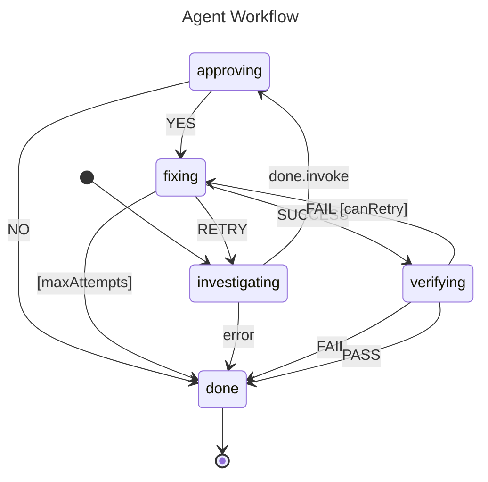

# Agent Workflow

This example models an autonomous agent that investigates a problem (asynchronously), requests human approval, attempts a fix, and verifies the result. The agent can retry on failure — a `RETRY` event loops back to investigating — and an `Always` guard on the fixing state automatically bails out after two fix attempts, preventing infinite loops.

## State Diagram



## What Happens

The agent starts in **investigating**, which fires an async `Invoke` to run diagnostics. When the invocation completes, the `done.invoke` event moves the agent to **approving**. A simulated controller sends `YES`, advancing to **fixing**.

On the first fix attempt the controller sends `RETRY`, which loops back to **investigating** for another round of diagnostics. The agent goes through approving a second time, gets another `YES`, and lands in **fixing** again.

This time the controller sends `SUCCESS`, moving to **verifying**. The controller sends `PASS`, and the agent transitions to **done** — a final state whose entry action prints a completion message.

If the agent ever reached two fix attempts without success, the `Always` guard (`maxAttempts`) on fixing would fire automatically and send it straight to **done**, bypassing any further retries.

## When To Use This

- **CI/CD pipelines** — build → test → deploy with automatic retry on transient failures and a hard cap on attempts.
- **Customer support bots** — triage → escalate → resolve, with human-approval gates between stages.
- **Automated remediation** — detect → diagnose → fix → verify, with retry budgets so the system doesn't loop forever.

## Output

```
--- Starting Agent Actor ---
-> [investigating] Running diagnostics...
Current State: investigating
Current State: investigating
Current State: approving
Action: Sending YES
Current State: fixing
Action: Sending RETRY
-> [fixing] Retry attempt 1
-> [investigating] Running diagnostics...
Current State: investigating
Current State: investigating
Current State: approving
Action: Sending YES
Current State: fixing
Action: Sending SUCCESS
Current State: verifying
Action: Sending PASS
-> [done] Agent workflow complete.
Current State: done

Simulation finished.
```

## Running

```bash
go run .
```
