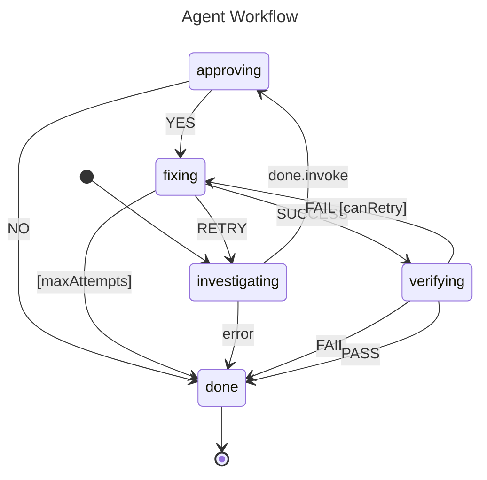

# Agent Workflow

This example models an autonomous agent with investigation, approval, fix/retry,
and verification phases. It demonstrates how to combine `Invoke()`, guards,
`Always()` transitions, and retry logic in a single statechart.

## State Diagram



## Key Concepts

- **`Invoke()`** for async investigation — the `investigating` state delegates to an invoked service and transitions on `done.invoke` or `error`
- **`Always()` with guard** for automatic bail-out at max attempts (`[maxAttempts]`)
- **Guarded transitions** (`[canRetry]`) for conditional retry logic
- **Multiple transitions on the same event** — `FAIL` with and without a guard on `verifying`
- **Final state** (`done`) for workflow completion

## Running

```bash
go run .
```
