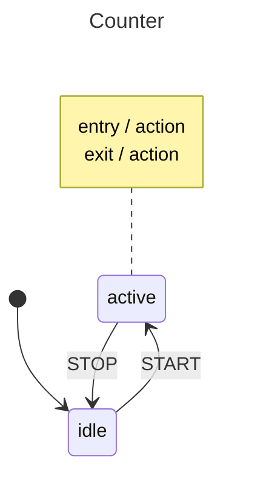

# Basics

This example builds a simple counter state machine with two modes — **idle** and **active**. While idle, `INCREMENT` events bump a counter using a self-transition (the `Assign` callback runs but the state stays the same). A `START` event moves to active, and `STOP` returns to idle. The active state has entry and exit actions that log messages when the machine arrives or leaves. All state and event identifiers use typed string constants (`MyState`, `MyEvent`) for compile-time safety.

## State Diagram



## What Happens

1. The machine starts in **idle** with `Count: 0`.
2. Two `INCREMENT` events fire. Each one triggers an `Assign` callback that increments the count and prints a message — but the machine stays in idle. This is a **self-transition**: context changes without a state change.
3. A `START` event transitions the machine to **active**. The entry action fires and logs `[active] Entering state...`.
4. A `STOP` event transitions back to **idle**. The exit action on active fires first, logging `[active] Leaving state...`.
5. The final state is idle with `Count: 2` — the count persists across transitions.

## When To Use This

- **Form validation** — idle / submitting / submitted states, with field-update events handled as self-transitions that validate and store input without changing state.
- **Connection managers** — disconnected / connecting / connected states, with retry counters incremented via self-transitions on failure events.
- **UI components** — enabled / disabled modes with entry/exit actions that toggle visual indicators, and event counters tracked through assigns.

## Output

```
--- Starting Actor ---
[idle] Incremented count to: 1
[idle] Incremented count to: 2
Current state: idle, Count: 2

--- Moving to Active ---
[active] Entering state...
Current state: active

--- Stopping ---
[active] Leaving state...
Final state: idle, Count: 2
```

## Running

```bash
go run .
```
