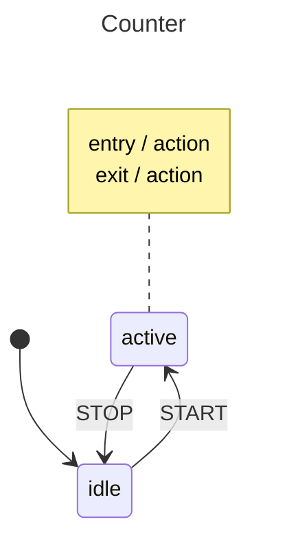

# Basics

This example demonstrates the core building blocks of `gstate`: defining states and events as typed constants, handling transitions between states, using entry/exit actions, and updating context with `Assign`.

## State Diagram



## Key Concepts

- **Typed state & event constants** — States (`StateIdle`, `StateActive`) and events (`EventIncrement`, `EventStart`, `EventStop`) are defined as typed string constants, giving you compile-time safety.
- **Context and `Assign`** — The `MyContext` struct holds runtime data (a counter). `Assign` updates context in response to an event without changing state.
- **Entry / Exit actions** — `s.Entry(...)` and `s.Exit(...)` register callbacks that run when a state is entered or left, useful for setup and teardown logic.
- **Self-transitions** — `EventIncrement` is handled in `idle` without a `GoTo`, so the machine stays in `idle` while still running the `Assign` callback to update the count.

## Running

```bash
go run .
```
