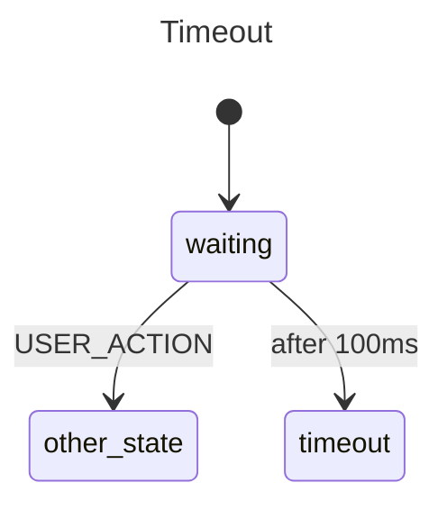

# Delayed Transitions

Demonstrates automatic time-based transitions using `After()`. Useful for
timeouts, heartbeats, and debouncing — no manual timer management needed.

## State Diagram



## Key Concepts

- **`After(duration)`** triggers a transition after the specified time elapses
- The timer is **automatically cancelled** if the state is exited early (e.g. by `USER_ACTION`)
- Useful for **timeouts**, **heartbeats**, and **debouncing**
- No manual timer management needed — the statechart handles it

## Running

```sh
go run .
```
