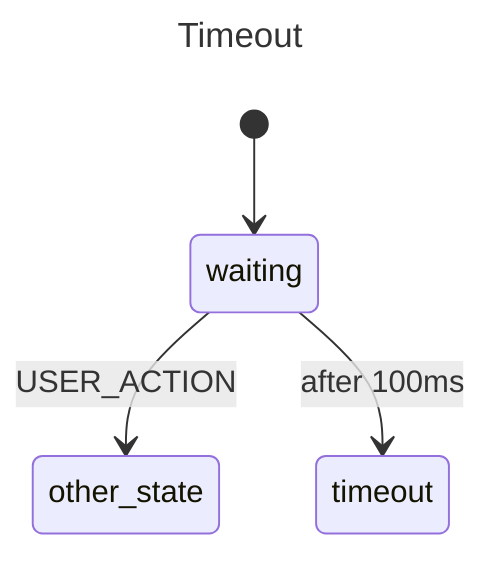

# Delayed Transitions

This example models a state with a built-in timeout. The machine enters a
`waiting` state and starts a 100ms timer. If no event arrives before the
timer fires, the machine automatically transitions to `timeout`. But if a
`USER_ACTION` event shows up in time, the machine moves to `other_state`
and the pending timer is cancelled — no cleanup code required.

## State Diagram



## What Happens

**Case 1 — Timeout fires.** The machine enters `waiting` and the 100ms
timer starts. No events arrive. After 100ms the delayed transition fires
and the machine moves to `timeout`.

**Case 2 — Escaped before timeout.** The machine enters `waiting` and the
same 100ms timer starts, but this time a `USER_ACTION` event is sent at
roughly 20ms. The machine exits `waiting` and transitions to `other_state`.
Because the state was exited, the pending timer is automatically cancelled
and `timeout` never fires.

## When To Use This

- **Session timeouts** — idle too long and the user is logged out.
- **Debounced input** — wait for typing to stop before running validation.
- **Heartbeat monitors** — no ping within N seconds means disconnected.

## Output

```
--- Test Case 1: Reaching the Timeout ---
[waiting] State entered. Starting 100ms timer...
[timeout] The timer fired! Transitioned successfully.

--- Test Case 2: Escaping before Timeout ---
[waiting] State entered. Starting 100ms timer...
Action: Sending 'USER_ACTION' before 100ms is up...
[other_state] Left 'waiting' before timeout.

--- Conclusion ---
Delayed transitions handle complex time-based logic natively,
eliminating the need for manual time.Sleep() or timers.
```

## Running

```bash
go run .
```
