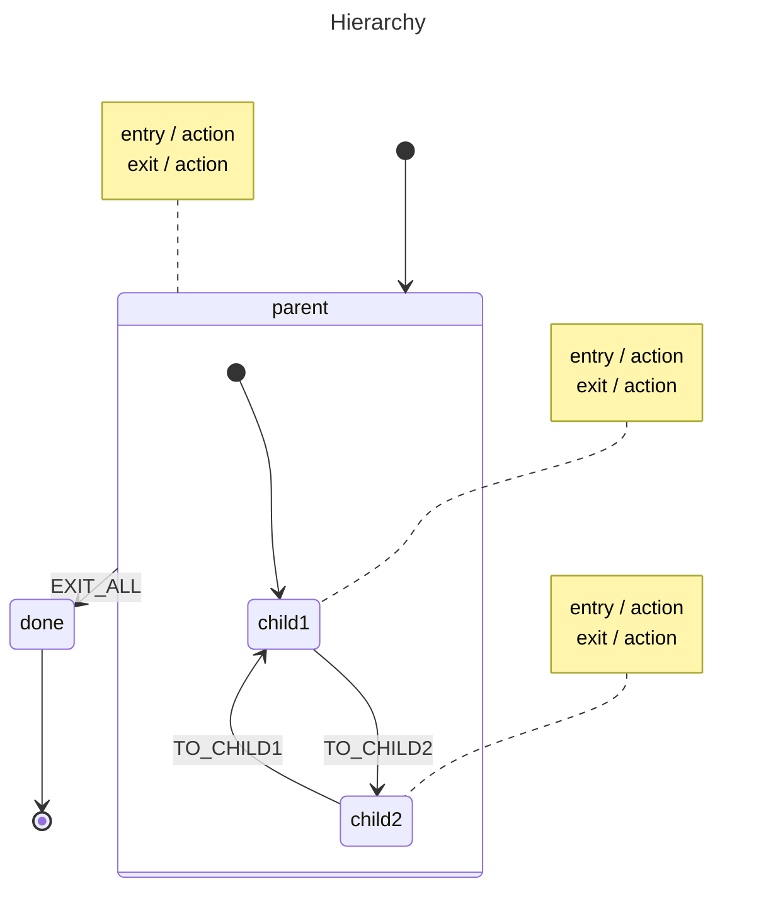

# Hierarchy

This example demonstrates nested (compound) states, where a **parent** state contains two child screens (`child1` and `child2`). You can switch between children freely, while the parent remains active and holds shared lifecycle logic. When an `EXIT_ALL` event fires from any child, it bubbles up to the parent — which transitions the entire hierarchy to a `done` final state, showing how events propagate upward through the state tree.

## State Diagram




<details>
<summary>SCXML</summary>

```xml
<?xml version="1.0" encoding="UTF-8"?>
<scxml xmlns="http://www.w3.org/2005/07/scxml" version="1.0" name="hierarchy" initial="parent">
  <final id="done"></final>
  <state id="parent" initial="child1">
    <onentry></onentry>
    <onexit></onexit>
    <transition event="EXIT_ALL" target="done"></transition>
    <state id="child1">
      <onentry></onentry>
      <onexit></onexit>
      <transition event="TO_CHILD2" target="child2"></transition>
    </state>
    <state id="child2">
      <onentry></onentry>
      <onexit></onexit>
      <transition event="TO_CHILD1" target="child1"></transition>
    </state>
  </state>
</scxml>
```

</details>

## What Happens

1. **Start → `parent` → `child1`:** The machine enters `parent` first, firing its entry action, then descends into the initial child `child1` and fires that entry action. The active states stack is `[parent, child1]`.
2. **`TO_CHILD2`:** `child1` handles the event directly — its exit action fires, then `child2`'s entry action fires. The parent stays active throughout because only the leaf state changed. Stack becomes `[parent, child2]`.
3. **`EXIT_ALL`:** `child2` has no handler for this event, so it **bubbles up** to `parent`. The parent does handle it: `child2`'s exit action fires first (innermost out), then the parent's exit action fires, and the machine transitions to the `done` final state.

## When To Use This

- **Wizard / multi-step forms** — each step is a child state; the parent holds shared header, footer, or validation logic that persists across steps.
- **Game screens** — menu, playing, and paused states live inside a game-session parent that manages resources common to all screens.
- **Document editors** — editing, reviewing, and commenting are substates of an "open document" parent that tracks unsaved changes and file handles.

## Output

```
--- Starting Actor ---
[parent] Entering...
  [child1] Entering...
Initial States Stack: [parent child1]

--- Sending 'TO_CHILD2' ---
  [child1] Exiting...
  [child2] Entering...
States Stack: [parent child2]

--- Sending 'EXIT_ALL' (Bubbles to Parent) ---
  [child2] Exiting...
[parent] Exiting...
States Stack: [done]
```

## Running

```bash
go run .
```
