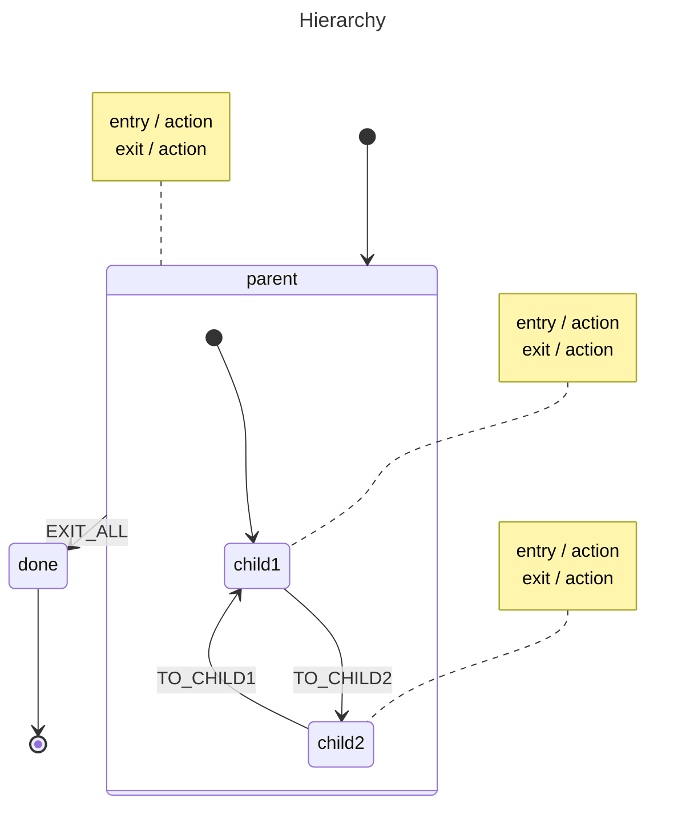

# Hierarchy

Demonstrates **nested (compound) states**, event bubbling, and shared
entry/exit actions using the `gstate` statechart library.

A `parent` state contains two children (`child1`, `child2`). Events bubble
up the hierarchy, so `EXIT_ALL` is handled by the parent even when the
machine is in `child2`. Entry and exit actions on `parent` fire whenever a
child transition crosses the parent boundary.

## State Diagram



## Key Concepts

- **Compound states** – `parent` declares an `Initial` child (`child1`),
  entered automatically when the machine transitions into `parent`.
- **Event bubbling** – `EXIT_ALL` is defined on `parent`, yet it triggers
  even when the active state is `child2`.
- **Entry/exit actions** – actions on `parent` run whenever a transition
  enters or leaves the compound state; child actions run on each internal
  transition.
- **`States()` returns the full path** from the root to the current leaf,
  e.g. `["parent", "child1"]`.

## Running

```bash
go run .
```
