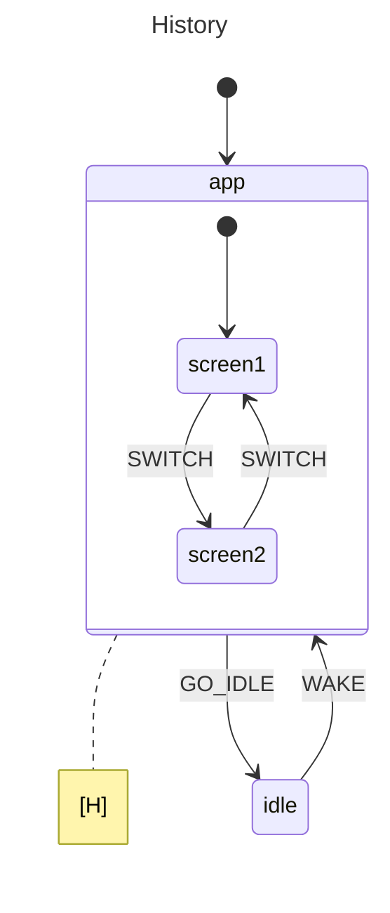

# History States

This example models an app with two screens where you can switch back and forth freely. Going idle leaves the app entirely, but waking up doesn't dump you back at screen1 — it drops you right where you left off. That's shallow history at work: the `app` state remembers which child was last active and restores it on re-entry.

## State Diagram



## What Happens

The app starts in `screen1`, the initial child of `app`. You fire `SWITCH` and land on `screen2`. Then `GO_IDLE` pulls you out of `app` entirely and into the `idle` state — `app` is fully exited, children and all.

Now `WAKE` transitions back into `app`. Without history this would mean starting over at `screen1`, since that's the initial child. But `app` is configured with `History: Shallow`, so it remembers that `screen2` was the last active child and restores it directly. You pick up exactly where you left off.

## When To Use This

- **Pause / resume flows** — a game paused mid-level resumes exactly where the player was, not back at the title screen.
- **Settings panels** — a user navigates to a specific sub-tab, leaves settings to check something, and returns to the same sub-tab.
- **Editor tabs** — switch to a different tool or view, then come back to the same file and position without manually tracking it.

## Output

```
--- Starting Actor ---
Initial: screen1

--- Switching Screen to screen2 ---
Current: screen2

--- Going to IDLE (Leaving 'app' completely) ---
Current: idle

--- Waking up (WAKE triggers GoTo('app')) ---
Resumed: screen2

--- Conclusion ---
History states make it easy to restore deep state hierarchy
without manual bookkeeping or flags.
```

## Running

```bash
go run .
```
