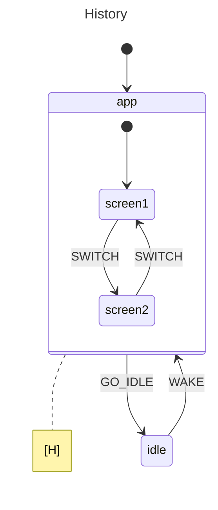

# History States

This example demonstrates **shallow history states** in `gstate`. A history
state remembers which child was active when a compound state is exited, so that
re-entering the compound state resumes where it left off instead of starting
from the initial child.

## State Diagram



## Key Concepts

- **`History(Shallow)`** remembers the last active child of a compound state.
- Re-entering `app` via the `WAKE` event resumes at `screen2` instead of the initial `screen1`.
- **[H]** in the diagram indicates shallow history.
- **Deep history** would also remember nested grandchild states.

## Running

```bash
go run .
```
