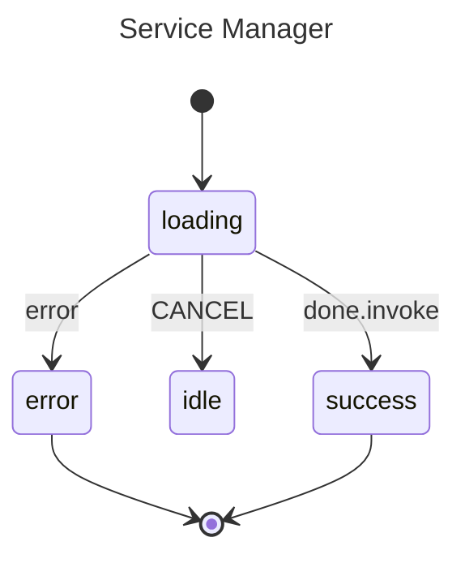

# Invoked Services

Demonstrates async goroutines bound to a state's lifecycle. When a state with
an `Invoke()` service is entered, gstate launches a goroutine. The goroutine's
`context.Context` is automatically cancelled when the state is exited—whether
by completion, error, or a manual event like `CANCEL`.

## State Diagram



## Key Concepts

- **`Invoke()` starts a goroutine** when the parent state is entered.
- **Automatic cancellation** — the `context.Context` passed to the invoked function is cancelled when the state is exited.
- **`nil` return** transitions the machine to the `onDone` target state (`success`).
- **Non-nil error** transitions the machine to the `onError` target state (`error`).
- **Manual events** (e.g. `CANCEL`) also exit the state, triggering context cancellation.

## Running

```sh
go run .
```
