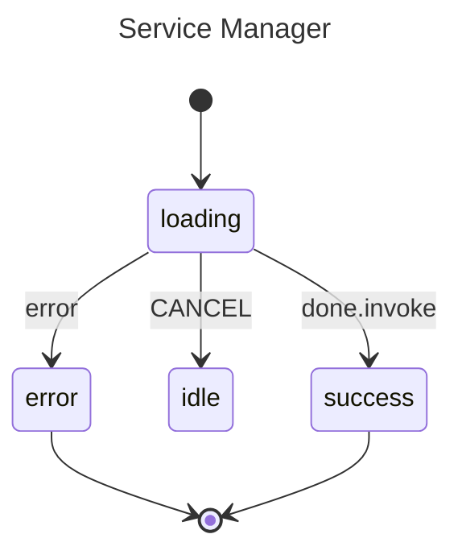

# Invoked Services

This example models a service manager that spawns asynchronous work when it enters a `loading` state. The goroutine is started via `Invoke` and is automatically cancelled when the state exits — whether that happens because the work finished or because a `CANCEL` event forced a transition. This tight coupling between a goroutine's lifetime and the state lifecycle prevents resource leaks without any manual cleanup.

## State Diagram



## What Happens

**Case 1 — Completion.** The machine starts in `loading`, which spawns a goroutine that simulates 100 ms of work. After the work finishes the goroutine returns `nil`, triggering the `onDone` path. The machine transitions to `success`, a final state.

**Case 2 — Cancellation.** The machine again starts in `loading` and spawns the same goroutine. After only 20 ms a `CANCEL` event is sent. The machine exits `loading` and moves to `idle`. Exiting the state cancels the goroutine's `context.Context`, so the goroutine sees `ctx.Done()`, prints a cancellation message, and exits cleanly.

## When To Use This

- **API calls** — enter a `loading` state that fetches data; transition to `success` or `error` on completion, and cancel the request automatically on timeout or user action.
- **File uploads** — an `uploading` state with a cancel button; pressing cancel exits the state and aborts the upload goroutine.
- **Background jobs** — a `processing` state that cleans up automatically if the user navigates away or the parent state is exited.

## Output

```
--- Test Case 1: Completion ---
  [Invoke] Starting async work...
  [Invoke] Task successfully completed!
Final State: success

--- Test Case 2: Cancellation ---
  [Invoke] Starting async work...
Action: Sending CANCEL event...
  [Invoke] Task was cancelled by state exit!
Final State: idle

--- Conclusion ---
Invoked services allow for clean async logic that is
tightly bound to the state lifecycle, preventing resource leaks.
```

## Running

```bash
go run .
```
