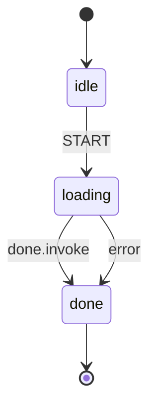

# Observer

This example attaches an **Observer** to a three-state machine (idle → loading → done) and shows the two main patterns: **live tracing** with a custom observer that prints transitions as they happen, and **post-hoc inspection** with a `RecordingObserver` that captures every lifecycle event for replay. Both observers are composed together with `MultiObserver` so a single `WithObserver` option wires up the full pipeline.

## State Diagram




<details>
<summary>SCXML</summary>

```xml
<?xml version="1.0" encoding="UTF-8"?>
<scxml xmlns="http://www.w3.org/2005/07/scxml" version="1.0" name="observer-demo" initial="idle">
  <final id="done"></final>
  <state id="idle">
    <transition event="START" target="loading"></transition>
  </state>
  <state id="loading">
    <transition event="done.invoke.loading" target="done"></transition>
    <transition event="error.platform" target="done"></transition>
    <invoke id="loading"></invoke>
  </state>
</scxml>
```

</details>

## What Happens

1. The machine starts in **idle**. A `loggingObserver` (which embeds `NopObserver` and overrides only `OnTransition`, `OnInvokeStarted`, and `OnInvokeCompleted`) is wired up alongside a `RecordingObserver` via `MultiObserver`.
2. A `START` event transitions from **idle** to **loading**. The logger prints the transition in real time: `idle --START--> loading`.
3. **loading** has an `Invoke` — a 50 ms async task. The logger prints when the invoke starts and when it completes, including the elapsed duration.
4. When the invoke finishes, the machine auto-transitions to **done** (a `Final` state). The logger prints the synthetic transition `loading ----> done`.
5. After the actor settles, the `RecordingObserver` replays all captured events — `state_entered`, `event_received`, `state_exited`, `invoke_started`, `transition`, `invoke_completed`, etc. — showing the full lifecycle trace in declaration order.
6. The last transition is serialized to JSON, demonstrating that event payloads carry `json` tags for shipping to telemetry pipelines or persisting for audit logs.

## When To Use This

- **Structured logging** — embed `NopObserver` and override `OnTransition` to emit structured log lines (JSON, logfmt) for every state change without touching business logic.
- **Metrics & tracing** — use `OnInvokeStarted`/`OnInvokeCompleted` to record invoke durations as histogram metrics or OpenTelemetry spans.
- **Test assertions** — attach a `RecordingObserver` in tests to assert the exact sequence of lifecycle events without polling or `time.Sleep`.
- **Audit trails** — serialize `RecordedEvent` payloads to a durable store for compliance or debugging. The JSON tags on `TransitionEvent`, `InvokeEvent`, etc. make this zero-effort.
- **Debugging** — during development, drop in a `MultiObserver` with a logger to see exactly what the engine is doing without adding `fmt.Println` to callbacks.

## Output

```
ActorID: <nanoid>
[<nanoid>] invoke started in loading
[<nanoid>] idle --START--> loading
[<nanoid>] invoke in loading completed in ~50ms
[<nanoid>] loading ----> done

Recorded events:
  state_entered: state[<nanoid>]: idle
  event_received: event[<nanoid>]: START
  state_exited: state[<nanoid>]: idle
  state_entered: state[<nanoid>]: loading
  invoke_started: invoke[<nanoid>]: state=loading
  transition: transition[<nanoid>]: idle --START--> loading
  invoke_completed: invoke[<nanoid>]: state=loading duration=~50ms
  state_exited: state[<nanoid>]: loading
  state_entered: state[<nanoid>]: done
  transition: transition[<nanoid>]: loading ----> done

Last transition as JSON:
  {
    "machine_id": "observer-demo",
    "actor_id": "<nanoid>",
    "from": "loading",
    "to": "done",
    "context": {
      "Attempts": 0
    },
    "timestamp": "..."
  }
```

## Running

```bash
go run .
```
