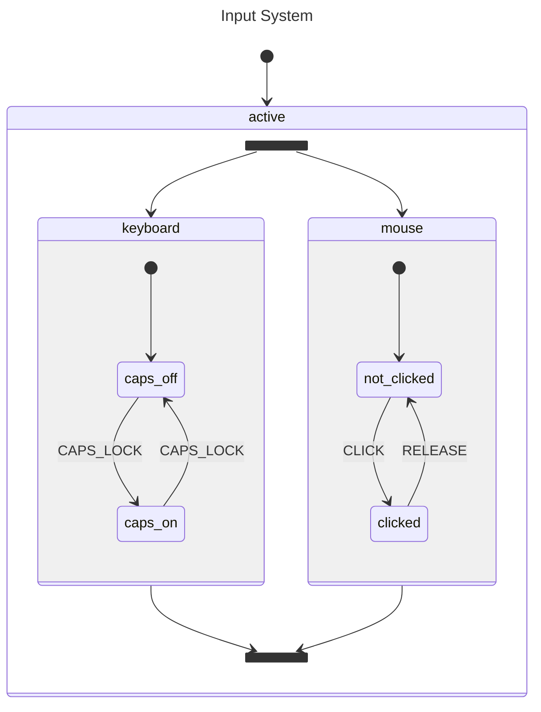

# Parallel States

This example models a computer input system where a keyboard and mouse operate independently inside a single `active` state. The keyboard tracks whether caps lock is on or off, while the mouse tracks whether a button is clicked or released. Because both regions live inside a `Parallel` state, they run simultaneously — a `CLICK` event only affects the mouse region and a `CAPS_LOCK` event only affects the keyboard region.

## State Diagram



## What Happens

When the actor starts, it enters the `active` parallel state, which activates both the `keyboard` and `mouse` regions at the same time. The keyboard begins in `caps_off` and the mouse begins in `not_clicked`.

Sending `CLICK` toggles the mouse region to `clicked` while the keyboard stays in `caps_off` — the event has no effect on a region that doesn't handle it. Sending `CAPS_LOCK` then toggles the keyboard to `caps_on` while the mouse stays in `clicked`. Neither region interferes with the other, and `States()` returns all active leaf states across both regions.

## When To Use This

- **Media players** — playback, volume, and display mode each operate as independent regions, so pressing mute doesn't pause the video.
- **Form validation** — each field runs its own validation region independently, letting one field show an error while others remain valid.
- **Monitoring dashboards** — CPU, memory, and disk health are tracked as separate regions, each with its own normal/warning/critical states.

## Output

```
--- Starting Parallel Actor ---
Active States: [active keyboard mouse not_clicked caps_off]

--- Sending 'CLICK' ---
Active States: [active keyboard mouse clicked caps_off]

--- Sending 'CAPS_LOCK' ---
Active States: [active mouse keyboard caps_on clicked]

--- Conclusion ---
Parallel states avoid the 'state explosion' problem by letting you
model independent behaviors without creating states for every combination.
```

## Running

```bash
go run .
```
