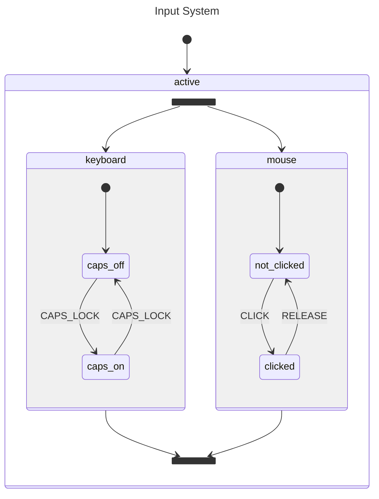

# Parallel States

This example demonstrates **orthogonal (parallel) regions** in a statechart.
An `active` state contains two independent regions — `keyboard` and `mouse` —
that are both active simultaneously. Each region transitions independently,
so a `CLICK` event only affects the mouse region while the keyboard region
remains unchanged. This avoids the combinatorial explosion of states that
would result from modeling every combination explicitly.

## Statechart



## Key Concepts

- **`Type(Parallel)`** makes all children active simultaneously
- Each region transitions independently — `CLICK` only affects the mouse region
- **`States()`** returns multiple leaf states (one per region)
- Avoids combinatorial explosion of states (2 × 2 = 4 explicit states reduced to 2 + 2)

## Running

```bash
go run .
```
