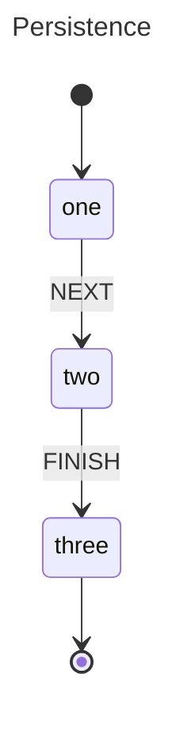

# Persistence

This example models a durable three-step workflow that survives process restarts by serializing its state to JSON and restoring it later. An actor progresses partway through a statechart, gets snapshotted, and a brand-new actor is hydrated from that snapshot — picking up exactly where the first one left off.

## State Diagram




<details>
<summary>SCXML</summary>

```xml
<?xml version="1.0" encoding="UTF-8"?>
<scxml xmlns="http://www.w3.org/2005/07/scxml" version="1.0" name="persistence_demo" initial="one">
  <state id="one">
    <transition event="NEXT" target="two"></transition>
  </state>
  <final id="three"></final>
  <state id="two">
    <transition event="FINISH" target="three"></transition>
  </state>
</scxml>
```

</details>

## What Happens

The actor starts in state **one**. Sending `NEXT` transitions it to **two** and sets the context value to `"step1_complete"`. At this point `Snapshot()` captures the active states, history, and context as a JSON blob, which is printed to the console.

A new actor is then created with `Hydrate()` using that JSON. It starts directly in state **two** with the context value `"step1_complete"` — no replaying of earlier events required. Sending `FINISH` to the hydrated actor transitions it to the final state **three** and updates the context to `"step2_complete"`, completing the workflow.

Note that the context struct must have `json` struct tags so the snapshot can serialize and deserialize it correctly.

## When To Use This

- **Long-running workflows** — an order-processing pipeline that spans hours or days can checkpoint its progress and resume after a deploy or crash.
- **Serverless functions** — save state to a database between invocations so each Lambda or Cloud Function picks up where the last one stopped.
- **User onboarding flows** — persist the current step so users can close their browser and resume exactly where they left off.

## Output

```
--- Step 1: Start Actor and Trigger a Transition ---
Serialized Snapshot:
{
  "active": [
    "two"
  ],
  "history": {},
  "context": {
    "value": "step1_complete"
  }
}

--- Step 2: Hydrate a New Actor from the Snapshot ---
Hydrated State: two
Hydrated Context: step1_complete

--- Step 3: Continue Workflow from Hydrated Actor ---
Final State: three
Final Context: step2_complete

--- Conclusion ---
Persistence allows you to decouple the machine execution from
the process lifecycle, enabling durable state charts.
```

## Running

```bash
go run .
```
