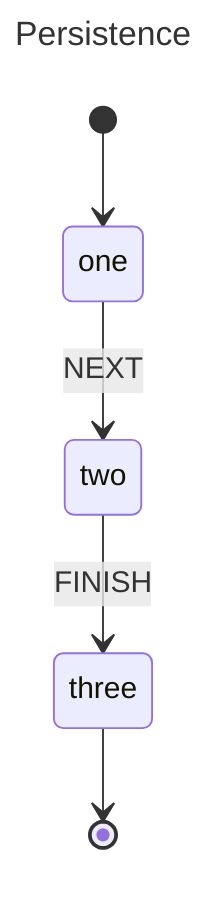

# Persistence

Save and restore actor state across process restarts using `Snapshot` and `Hydrate`. This example demonstrates durable workflow support by serializing an actor's full state to JSON and reconstructing it in a new process.

## State Diagram



## Key Concepts

- **`Snapshot()`** captures the actor's active states, history, and context into a serializable struct
- Snapshots are **JSON-serializable**, making them easy to store in a database or file
- **`Hydrate()`** creates a new actor in the exact same state as when the snapshot was taken
- Context must be **JSON-serializable** — use struct tags (e.g., `` `json:"field"` ``) on your context type
- Enables **durable workflows** that survive process restarts, deployments, or crashes

## Running

```sh
go run .
```
